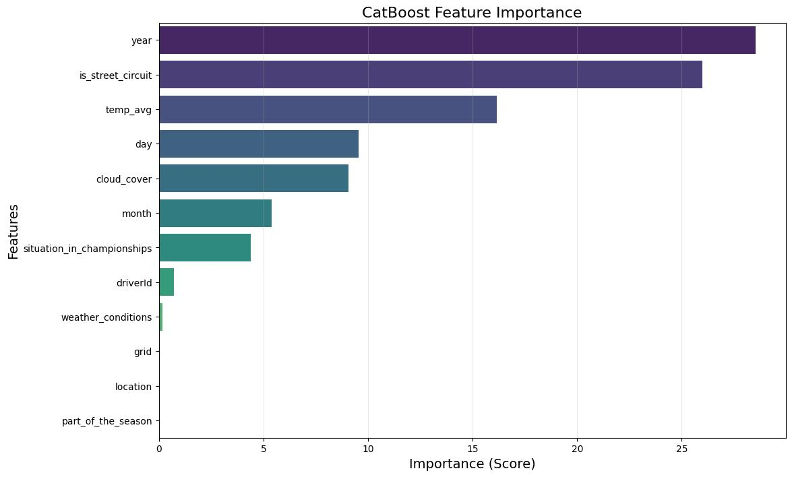

# ️ Formula 1 Safety Car Prediction
## Описание проекта
Этот проект посвящен решению задачи бинарной классификации: предсказание появления машины безопасности (Safety Car) в гонках F1. 

На основе исторических данных о погоде, трассах и стартовых позициях модель определяет вероятность появления Safety Car, что является критически важным фактором для построения гоночных стратегий и рекламных контрактов.

## Технологический стек
* **Python 3.12.12**
* **Data Manipulation:** Pandas, NumPy
* **Machine Learning:** CatBoost, Scikit-learn
* **Visualization:** Matplotlib, Seaborn
* **Interpretability:** LIME, SHAP

## Данные
Датасет содержит информацию о гонках, включая:
* **Погодные условия:** `temp_avg`, `cloud_cover`, `weather_conditions`
* **Характеристики трассы:** `is_street_circuit`, `location`
* **Информация о гонке:** `grid`, `driverId`, `part_of_the_season`

*Целевая переменная:* `safety_car_race` (0 — не было появления safety car, 1 — было).

## Предобработка и Feature Engineering
1.  **Категориальные признаки:** Использован `OrdinalEncoder` и встроенная обработка категорий в CatBoost.
2.  **Пропуски:** Заполнены с помощью `SimpleImputer` (заменены средним значением).
3.  **Числовые признаки:** Использован `StandardScaler`.
4.  **Булевы признаки:** Изменение типов для корректной обработки моделью.

## Модель
В качестве основной модели выбран **CatBoostClassifier**, так как он лучше всего работает с категориальными данными без необходимости раздувать пространство признаков через OHE.

**Параметры модели:**
* Loss Function: `Logloss`
* Metric: `AUC`
* Iterations: 1000
* Learning Rate: 2e-4

## Результаты
Модель показала следующие метрики на тестовом датасете:
* **ROC-AUC:** `0.65`
* **Accuracy:** `0.66`
* **F1-score** `0.71`

### Важность признаков (Feature Importance)
Ниже представлен график признаков, оказывающих наибольшее влияние на предсказание:

Неожиданно, год проведения гонки вносит высокий вклад в решение модели. Так же, тип трассы сильно влияет на результат работы модели.

А вот расположение гонщиков на старте и погодные условия почти не влияет на выезд safety car.

## Запуск модели
Для запуска модели достаточно запустить 1st Checkpoint/Импорт и 3rd Checkpoint.